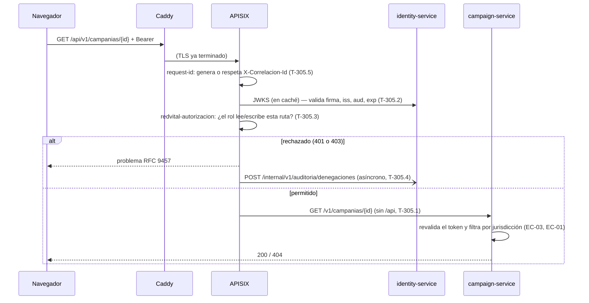

# api-gateway — Apache APISIX (modo DB-less)

Punto único de entrada de RedVital detrás de Caddy. Sin base de datos ni
panel administrativo: toda la configuración es este repositorio.

| Archivo | Tarea |
|---|---|
| `config/apisix.yaml` → `bloquear-internal`, `proxy-rewrite` | T-305.1 — rutas `/api/v1/*` → `/v1/*`, `/internal/` nunca se enruta |
| `config/apisix.yaml` → `plugin_configs.con-sesion` (openid-connect) | T-305.2 — firma RS256, emisor, audiencia y vigencia contra el JWKS |
| `plugins/apisix/plugins/redvital-autorizacion.lua` → `access` | T-305.3 — compuerta por ruta y rol |
| `plugins/apisix/plugins/redvital-autorizacion.lua` → `log` | T-305.4 — denegaciones a la auditoría de Identidad |
| `config/apisix.yaml` → `global_rules.correlacion` | T-305.5 — `X-Correlacion-Id` generado o propagado |
| `pruebas/t-305.6-gateway.sh` | T-305.6 — pruebas del gateway |
| `pruebas/t-303.3-qa-rechaza-llave-prueba.sh` | T-303.3 — verificación contra QA |

## Recorrido de una petición

## Levantar en local
1. Crea la credencial de servicio del gateway (una vez):
   `dotnet run --project ../identity-service/herramientas/LlaveDePrueba -- credencial-servicio --cliente gateway --secreto <secreto>`
   → ejecuta el `INSERT` que imprime contra `db_identidad`.
2. Guarda ese mismo secreto en `secretos/gateway-secreto-cliente` (no se versiona).
3. Conecta APISIX, Caddy y los servicios Identity/Campaign a las redes Docker
   `red_borde` y `red_aplicacion`. Este Compose es un fragmento de gateway:
   Identity y Campaign deben estar levantados y anunciar los nombres
   `identity-service` y `campaign-service` en `red_aplicacion`.
4. Ejecuta `docker compose -f docker-compose.gateway.yml up -d`; el puerto local
   predeterminado es 9080 y se puede cambiar con `APISIX_PORT`.
5. Ejecuta `bash pruebas/t-305.6-gateway.sh`.

## Límites conocidos (a confirmar en la prueba de concepto del ADR del Gateway)
- La respuesta 401 la genera el plugin openid-connect y **no** sigue el formato RFC 9457.
- Confirmar que el `log` del plugin propio se ejecuta también cuando openid-connect
  corta la petición con 401 (es lo que permite auditar los tokens inválidos).
- El límite de tasa en dos escalas no está aquí: no es tarea de este backlog.
